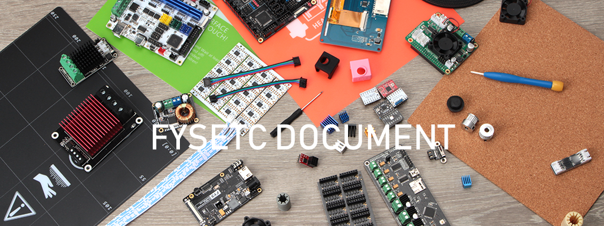

## Introduction

 <table><tr><td bgcolor=#FAFAD2>Welcome to FYSETC Wiki. Here, you will find user manuals and tutorials for [FYSETC's](https://www.fysetc.com) products. This website will constantly updated. </td></tr></table> 

---
<table>
<tr>
<td></td><td></td><td></td>
</tr>
<tr>
<td></td><td></td><td></td>
</tr>
<tr>
<td></td><td></td><td></td>
</tr>
<tr>
<td></td>
</tr>
</table>

## Copyright/License
-------
Copyright (c) 2014-2018 FYSETC Inc. (https://www.fysetc.com). All documents and pictures align with <a rel="license" href="http://creativecommons.org/licenses/by-sa/4.0/">Creative Commons Attribution-ShareAlike 4.0 International License</a>. . 

## Tech Support
Please submit any technical issue into our [forum](http://forum.fysetc.com/) 