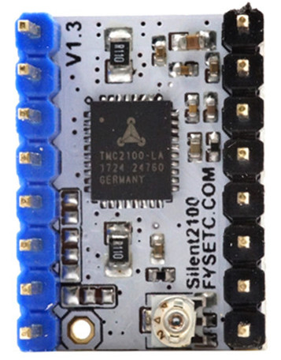
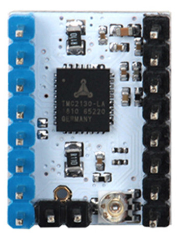
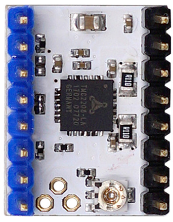

FYSETC TMC|TMC2100|TMC2130|TMC2208
:---:                 |:---:           |:---:          |:---:
Bottom View|  |  |  
Interface|Step/Dir|Step/Dir or SPI|Step/Dir
Configuration|CFG Pins|CFG Pins or SPI|CFG Pins or UART
Native Microsteps\*|up to 1⁄16|up to 1⁄256|up to 1⁄256
microPlyer Microsteps|1⁄256|1⁄256|1⁄256
Logic Supply Voltage(VIO)|3 - 5V|3 - 5V|3 - 5V
Motor Supply Voltage(VM)|5.5 - 46V|5.5 - 46V|5.5 - 36V
Motor Phase Current max|1.2A RMS, 2.5A Peak|1.2A RMS, 2.5A Peak|1.2A RMS, 2.0A Peak
Internal V- Regulator\*\*|enabled|enabled|enabled
RDSon|\>=0.5 Ohm|\>=0.5 Ohm|<=0.3 Ohm
Standby current reduction|yes|yes|yes
stealthChop(quiet)|yes|yes|yes
spreadCycle|yes|yes|yes
coolStep|-|yes|-
stallGuard|-|yes|-
dcStep|-|yes|-

\* without interpolation (microPlyer)

\*\* Motor Supply Voltage (VM) is always needed, when the internal voltage regulator is enabled/used